# 今日精选（2026-03-09）

> 说明：本文由 Eyes 自动聚合与整理，面向国内读者做了中文简介与重点提炼。

## 1. 合法就等于正当吗？AI 重写与 copyleft 的式微

文章讨论一个很多人关心的问题：当 AI 用「重新实现」的方式复刻开源项目时，法律上可能没侵权，但在开源社区看来算不算正当？作者认为这种趋势正在侵蚀 copyleft 的精神，让「合法」和「大家心里认的正当」越来越不是一回事。对做开源、用法务或关心 AI 与版权的人都有参考价值。

**标签：** #思考 #AI/ML #开源

**原文：** https://writings.hongminhee.org/2026/03/legal-vs-legitimate/

---

## 2. JSLinux 现已支持 x86_64

Fabrice Bellard 在浏览器里用纯 JavaScript 跑了一个完整的 Linux，现在支持 x86_64。不装虚拟机、不装系统，打开网页就能体验。对普通人来说是「黑科技」展示，对开发者则能看到 JS 和浏览器的能力边界被推到什么程度。

**标签：** #开源 #基础设施 #Web

**原文：** https://bellard.org/jslinux/

---

## 3. nanochat：百元级最佳 ChatGPT

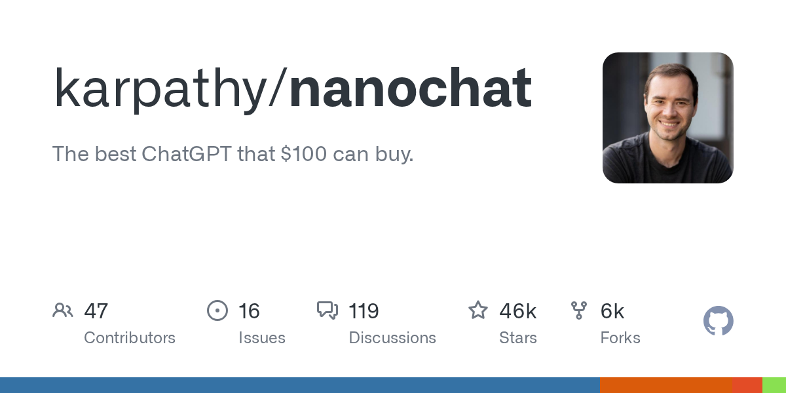

Karpathy 开源的项目：用大约一百美元就能跑起来的「本地版 ChatGPT」，强调性价比和可复现。核心思想是让普通人也能在自家机器上玩转大模型，不依赖大厂 API。对想低成本玩 LLM 的人非常实用。

**标签：** #AI/ML #开源

**原文：** https://github.com/karpathy/nanochat

---

## 4. Show HN：编程语言 Mog

Mog 是一门新推出的编程语言，面向数据和并发场景，语法简洁，还提供在线 Playground 方便试玩。作者分享了设计动机和与现有语言的取舍。对编程语言爱好者来说是一个值得围观的新选项。

**标签：** #开发工具 #开源

**原文：** https://moglang.org

---

## 5. Launch HN: Terminal Use (YC W26)——面向文件系统 Agent 的部署平台

YC W26 项目 Terminal Use 想做「基于文件系统的 AI Agent 的 Vercel」：帮你把这类 Agent 部署、跑起来，省去自己搞基础设施的麻烦。团队在 HN 上介绍了产品思路和当前进展。做 Agent 应用或创业的人可以关注这个方向。

**标签：** #创业 #AI/ML #基础设施

**原文：** https://news.ycombinator.com/item?id=47311657

---

## 6. LLM 写的是「像对的」代码，不是「对的」代码

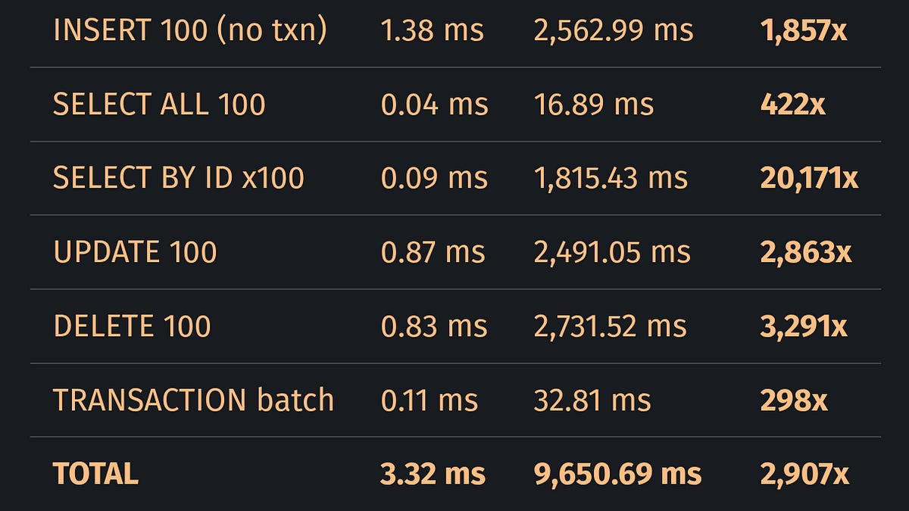

文章的核心观点是：大模型生成的代码往往是「看起来对」的代码，而不是真的逻辑正确、可长期维护的代码。作者提醒大家别被表面正确骗了，必须靠测试和审查把关。对用 AI 写代码的团队是一剂清醒剂。

**标签：** #AI/ML #思考

**原文：** https://blog.katanaquant.com/p/your-llm-doesnt-write-correct-code

---

## 7. 在 Android 上跑端侧 LLM：GGUF、NNAPI 与真实性能取舍

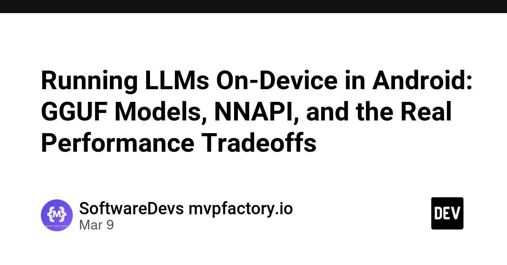

一篇偏实战的技术长文：在 Android 上跑端侧大模型，涉及 GGUF、NNAPI、显存占用和在中等机型上的性能取舍。对做移动端 AI 或端侧推理的工程师是实打实的参考，能少走弯路。

**标签：** #AI/ML #移动端 #基础设施

**原文：** https://dev.to/software_mvp-factory/running-llms-on-device-in-android-gguf-models-nnapi-and-the-real-performance-tradeoffs-5bfc

---

## 8. AI Agent 不必碰 UI，WebMCP 是第三条路

目前 Agent 和网页交互要么模拟点击、要么走 API。文章提出 WebMCP：通过一套协议让 Agent 直接和网页「对话」，不用真的去点界面。对做浏览器自动化或 Agent 架构的人是一个新思路。

**标签：** #AI/ML #Web

**原文：** https://dev.to/n_asuy/ai-agents-dont-need-to-touch-the-ui-webmcp-is-the-third-way-4fhp

---

## 9. BettaFish：多 Agent 舆情分析助手

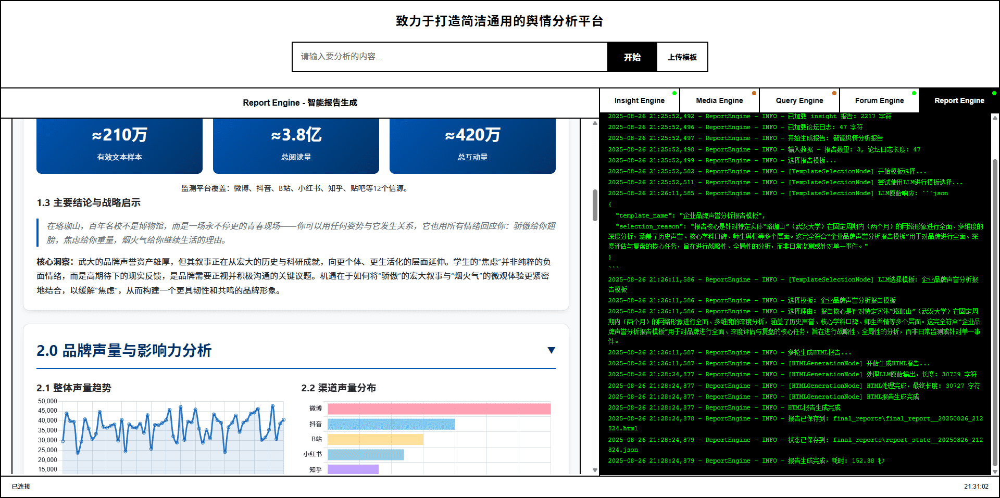

BettaFish（微舆）是一个多 Agent 舆情分析助手，从零实现、不依赖现成框架，目标是通过多源信息打破信息茧房、还原舆情、预测走向并辅助决策。对做舆情分析或多 Agent 系统的国内团队有参考价值。

**标签：** #AI/ML #开源 #数据

**原文：** https://github.com/666ghj/BettaFish

---

## 10. hermes-agent：与你一起成长的 Agent

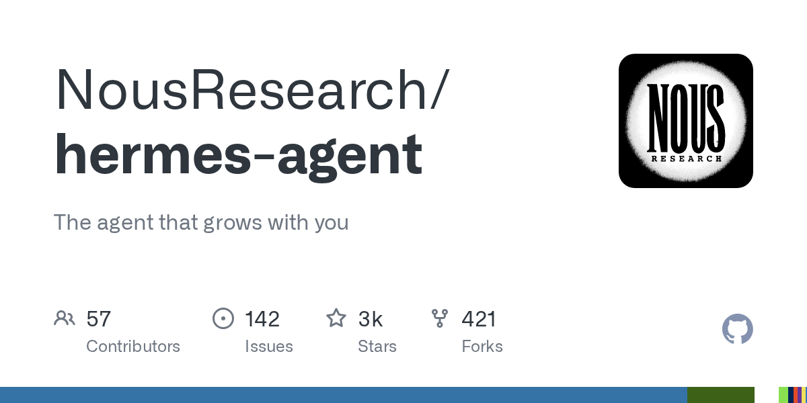

Nous Research 开源的 Agent 框架，主打「和你一起成长」：能随着使用和反馈越用越贴合你的需求。适合想做一个可长期用、可定制的个人或企业 Agent 的开发者。

**标签：** #AI/ML #开源

**原文：** https://github.com/NousResearch/hermes-agent

---

## 11. page-agent：用自然语言控制页面的 GUI Agent

阿里开源的「页面内 Agent」：用自然语言就能控制当前网页上的界面，不用写自动化脚本。TypeScript 实现，适合做浏览器自动化、可访问性工具或「用说话操作网页」类产品的人参考。

**标签：** #AI/ML #Web #开源

**原文：** https://github.com/alibaba/page-agent

---

## 12. claude-skills：169 个 Claude/Codex 即用技能与插件

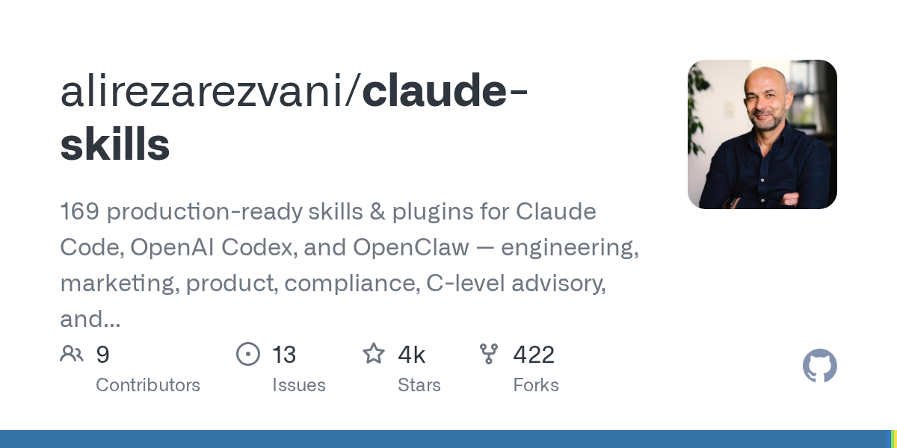

为 Claude Code、Codex、OpenClaw 等准备的 169 个即用型技能和插件，覆盖工程、营销、产品、合规、管理建议等。通过插件市场即可安装。用这些 AI 编程工具的人可以大幅少写重复劳动。

**标签：** #AI/ML #开发工具 #开源

**原文：** https://github.com/alirezarezvani/claude-skills

---

## 13. notebooklm-py：NotebookLM 的 Python/CLI/Agent 接口

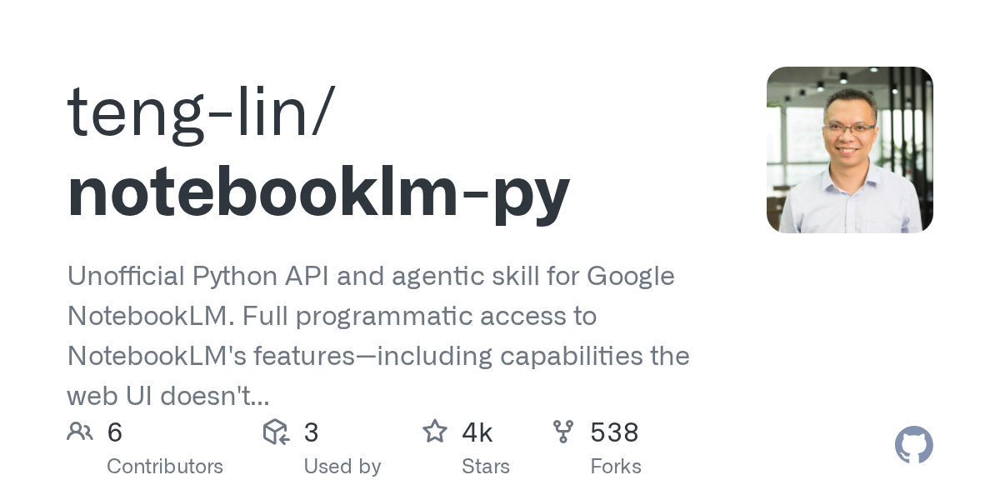

Google NotebookLM 的非官方 Python 接口和 Agent 技能，可以用代码、命令行或通过 Claude/Codex 等调用 NotebookLM 的能力，包括一些网页版没有开放的功能。做研究或 Agent 的人可以当桥梁用。

**标签：** #AI/ML #开发工具 #开源

**原文：** https://github.com/teng-lin/notebooklm-py

---

## 14. Linus Torvalds 染上 AI 写代码瘾

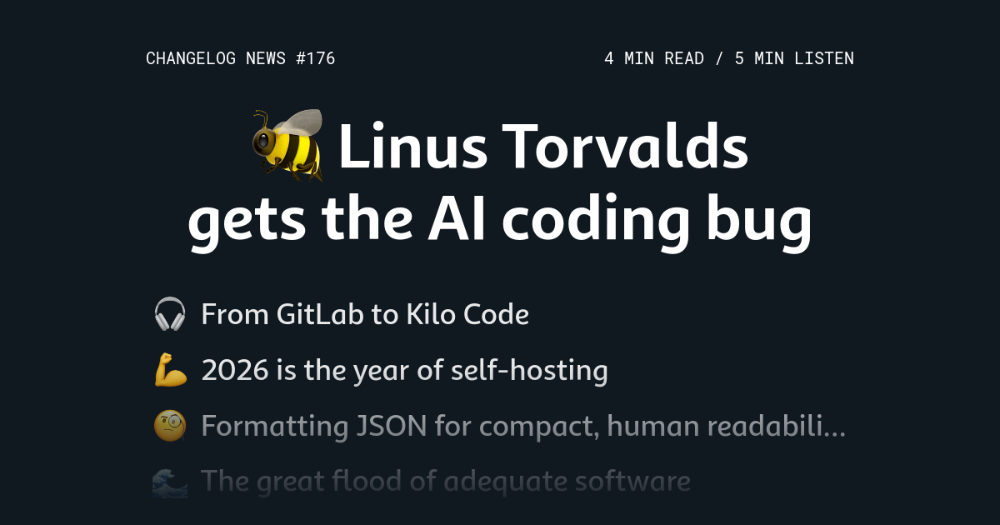

Linus 开始推 AI 生成代码、自托管之年、FracturedJson、「足够好」的软件会泛滥、以及为什么泛泛的设计建议没用。对关心内核和 AI 协作、或行业风向的人是一期有标志意义的周报。

**标签：** #AI/ML #行业动态 #思考

**原文：** https://changelog.com/news/176

---

## 15. 这类新 AI 岗位正在爆发

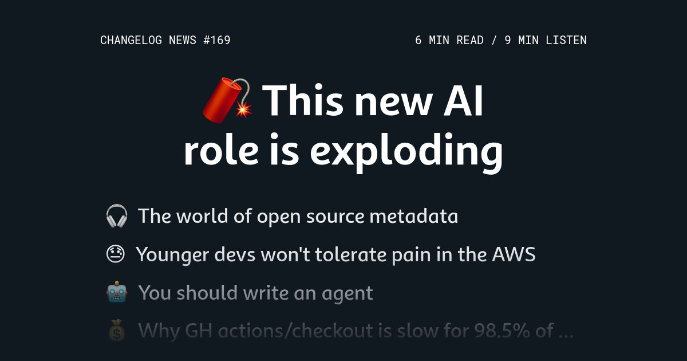

一种以 AI 为核心的新岗位在招聘里暴增。还聊了年轻开发者不愿忍 AWS 的痛、为什么你应该写一个 Agent、死框架论、别搞 vibe coding 等。对求职、转岗或关心行业趋势的人有参考。

**标签：** #职业 #AI/ML #行业动态

**原文：** https://changelog.com/news/169

---

## 16. 只招资深工程师正在害死公司

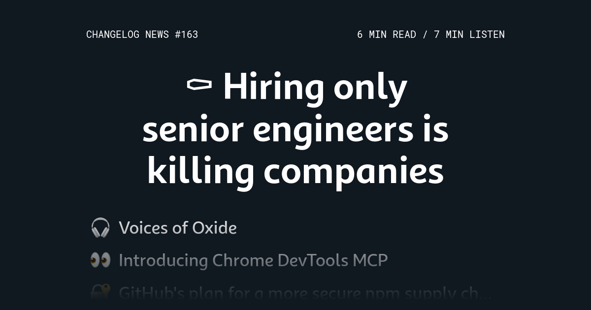

观点很直接：只招资深工程师正在拖垮很多公司，应该多招 junior。还涉及 Chrome DevTools MCP、GitHub 防 npm 攻击路线图、日程时间线 App 等。对招人和带团队的人是一剂提醒。

**标签：** #职业 #行业动态 #思考

**原文：** https://changelog.com/news/163

---

## 17. OpenAI 终止与 Oracle 的 Stargate 数据中心扩建合作

OpenAI 决定不再和 Oracle 一起扩建传说中的 Stargate 超大数据中心。报道从 Oracle 的数据中心策略和债务结构切入，解释为什么这次合作告吹、对 AI 基建格局有什么影响。关心大厂基建和商业动向的读者可以快速了解来龙去脉。

**标签：** #行业动态 #AI/ML

**原文：** https://www.cnbc.com/2026/03/09/oracle-is-building-yesterdays-data-centers-with-tomorrows-debt.html

---

## 18. GitHub Copilot CLI 挑战赛获奖名单公布

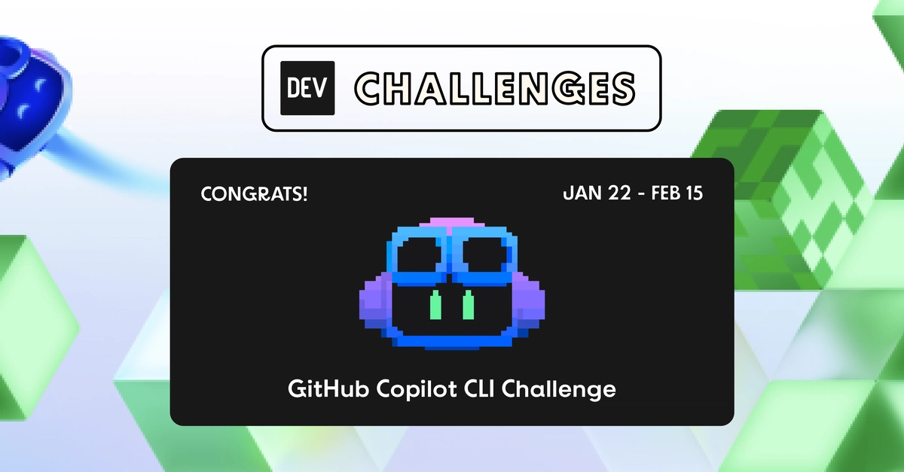

GitHub 官方公布了 Copilot CLI 挑战赛的获奖名单，从四百多份提交里评出了优胜项目。文章简要回顾了比赛和评审过程。想了解 Copilot 生态和 CLI 工具创意的开发者可以一看。

**标签：** #开发工具 #AI/ML

**原文：** https://dev.to/devteam/congrats-to-the-github-copilot-cli-challenge-winners-2240

---

## 19. 无生产数据也能得到生产级查询计划

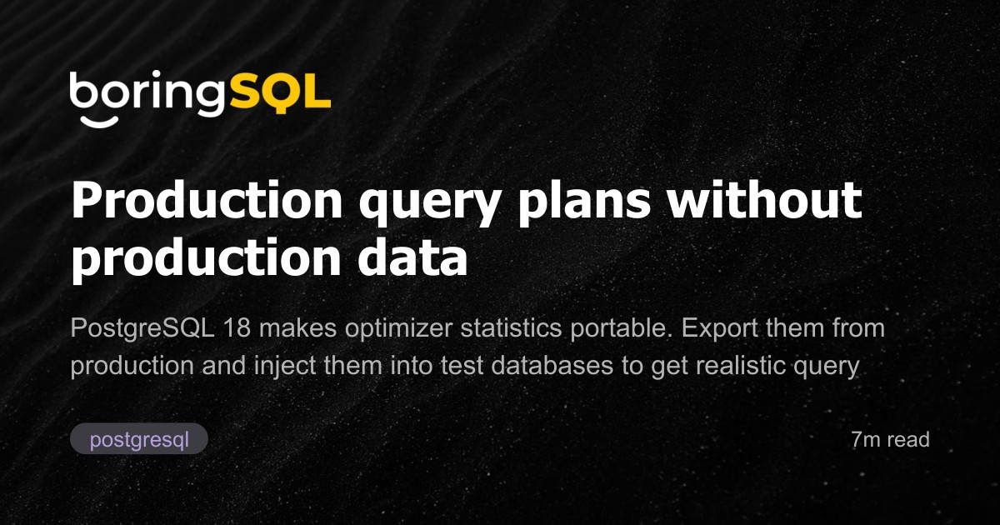

讲的是如何在不动生产数据的前提下，用「可移植的统计信息」在别处复现出接近生产环境的查询计划。对做数据库优化、在测试环境排障的工程师很有用，思路是把统计信息抽出来带着走。

**标签：** #基础设施 #数据

**原文：** https://boringsql.com/posts/portable-stats/

---

## 20. 2026 年再选 Rails

作者在 2026 年重新选择用 Rails 做主要技术栈，文章里写了他再次选用 Rails 的理由、和别的框架对比后的感受，以及实际用下来的体验。对在选型或关心 Web 框架的人有参考价值。

**标签：** #Web #开发工具

**原文：** https://www.markround.com/blog/2026/03/05/returning-to-rails-in-2026/

---

